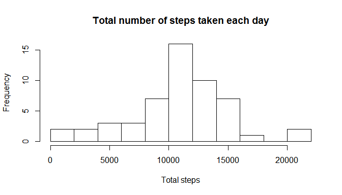
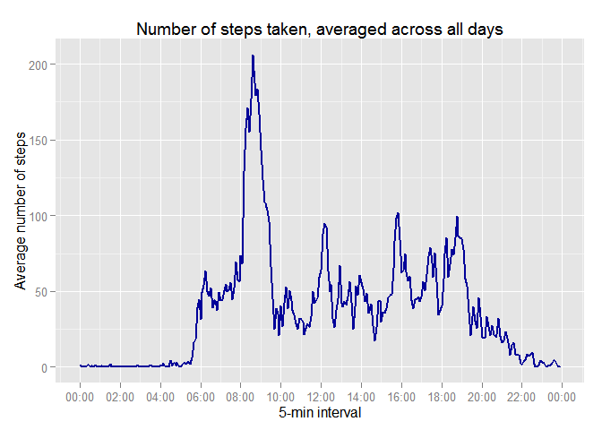
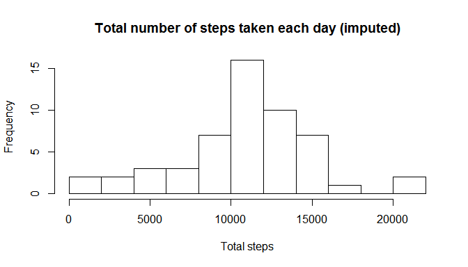
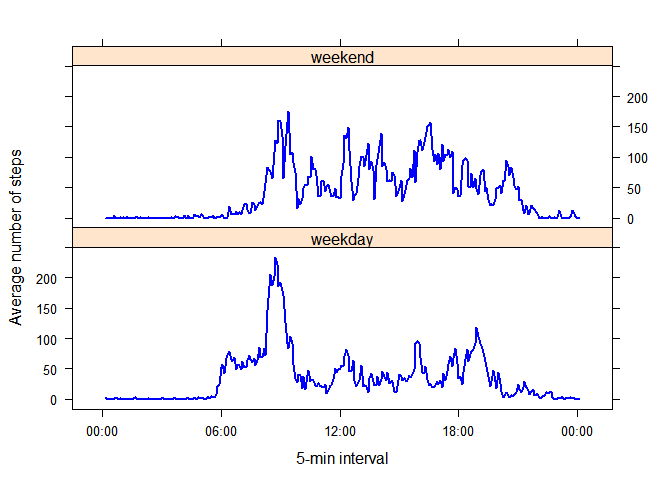

# Reproducible Research: Peer Assessment 1


Load some useful packages:

```r
library(dplyr)
library(lubridate)
library(ggplot2)
library(scales)
library(lattice)
```


## Loading and preprocessing the data

```r
dataFile <- 'activity.csv'
activity <- read.csv(dataFile,
                     colClasses=c("numeric", "POSIXct", "numeric"))
activity <- tbl_df(activity)
```

## What is mean total number of steps taken per day?

```r
activity_by_day <- activity %>% group_by(date)
by_day <- summarize(activity_by_day, total_steps=sum(steps))
```


The experiment was conducted for 61 days
(from 2012-10-01 to 2012-11-30).

1. The total number of steps taken per day is

```r
by_day$total_steps
```

```
##  [1]    NA   126 11352 12116 13294 15420 11015    NA 12811  9900 10304
## [12] 17382 12426 15098 10139 15084 13452 10056 11829 10395  8821 13460
## [23]  8918  8355  2492  6778 10119 11458  5018  9819 15414    NA 10600
## [34] 10571    NA 10439  8334 12883  3219    NA    NA 12608 10765  7336
## [45]    NA    41  5441 14339 15110  8841  4472 12787 20427 21194 14478
## [56] 11834 11162 13646 10183  7047    NA
```

2. The histogram of the total number of steps taken each day is as follows:

```r
hist(by_day$total_steps, breaks=10,
     main="Total number of steps taken each day", xlab="Total steps")
```

 

3. The mean of the total number of steps taken per day is

```r
mean_total_steps <- mean(by_day$total_steps, na.rm=TRUE)
mean_total_steps
```

```
## [1] 10766.19
```

The median of the total number of steps taken per day is

```r
median_total_steps <- median(by_day$total_steps, na.rm=TRUE)
median_total_steps
```

```
## [1] 10765
```

[//]: # (**zero** for all 53 days without
missing values. Indeed, there are 0
days where the median is not zero.)

## What is the average daily activity pattern?

```r
activity_by_interval <- activity %>% group_by(interval)
by_interval <- summarize(activity_by_interval,
                         avg_steps=mean(steps, na.rm=TRUE))
by_interval <- mutate(by_interval, time=fast_strptime(sprintf("%04d", interval),
                                                      "%H%M"))
## base plot
# with(by_interval, plot(time, avg_steps, type='l', col='blue', lwd=2,
#                        main="Number of steps taken, averaged across all days",
#                        xlab="5-min interval",
#                        ylab="Average number of steps"))
## ggplot2
ggplot(data=by_interval, aes(time, avg_steps)) + 
  geom_line(color="#000099", size=1) +
  scale_x_datetime(breaks=date_breaks("120 min"), labels=date_format("%H:%M")) +
  ggtitle("Number of steps taken, averaged across all days") +
  ylab("Average number of steps") + xlab("5-min interval")
```

 

The 5-min interval with the maximum number of steps, on average across all the
days in the dataset, is

```r
max_steps <- with(by_interval, by_interval[max(avg_steps) == avg_steps, 1])
max_steps
```

```
## Source: local data frame [1 x 1]
## 
##   interval
## 1      835
```

which corresponds to the 5-min interval starting at
8:35.


## Imputing missing values
1. The total number of missing values (coded as `NA`) in the dataset is

```r
missing <- is.na(activity$steps)
sum(missing)
```

```
## [1] 2304
```

2. In this particular dataset, whenever there is a missing value, there isn't a
single reported value for the whole day. The strategy of filling the missing
values with the mean/median for that day is therefore out of the picture.  
Instead, our strategy is to fill all missing values in the dataset by using the
number of steps taken, averaged across all days, of the corresponding 5-min
interval. 

3. More precisely, we impute as new value for each interval missing data
the mean of that interval across all days where we have data:

```r
activity_imputed <- activity
for (intval in by_interval$interval) {
  activity_imputed$steps[is.na(activity_imputed$steps) &
                           activity_imputed$interval==intval] <-
       by_interval$avg_steps[by_interval$interval==intval]
}
```

4. The total number of steps taken per day with the imputed values is obtained
as follows:

```r
activity_imputed_by_day <- activity_imputed %>% group_by(date)
imputed_by_day <- summarize(activity_imputed_by_day, total_steps=sum(steps))
```
We have the following histogram for the dataset with imputed values:

```r
hist(by_day$total_steps, breaks=10,
     main="Total number of steps taken each day (imputed)", xlab="Total steps")
```

 

The mean of the total number of steps taken per day with the imputed values is

```r
mean_total_steps_imputed <- mean(imputed_by_day$total_steps)
mean_total_steps_imputed
```

```
## [1] 10766.19
```
while the median is

```r
median_total_steps_imputed <- median(imputed_by_day$total_steps)
median_total_steps_imputed
```

```
## [1] 10766.19
```

With the abovementioned strategy, the mean of total steps computed with the
dataset where the missing values were filled in didn't differ from the
one obtained with the original dataset.  
Please note that the total steps for each imputed day is exactly the mean total
number of steps that we computed previously in the original dataset (remember,
in this particular dataset, any day with a missing value lacks data for all
5-min intervals for that day). So, it's not surprising that the mean total
number of steps remained the same.  
Algebraically, given the previous remark, if we denote by $\bar{x}_{n}$ the mean
of $n$ data points, the following result allows to conclude:
$\bar{x}_{n+m} = \frac{n}{n+m} \bar{x}_{n} + \frac{m}{n+m} \bar{x}_{m}$.


## Are there differences in activity patterns between weekdays and weekends?

```r
activity_work <- activity %>%
  mutate(day=ifelse(wday(date, label=TRUE) %in% c("Sat", "Sun"),
                    "weekend", "weekday")) %>%
  mutate(day=factor(day))
# activity_work[wday(activity_work$date, label=TRUE) %in% c("Sat", "Sun"),
#               'day'] <- "weekend"
# activity_work[! wday(activity_work$date, label=TRUE) %in% c("Sat", "Sun"),
#               'day'] <- "weekday"
# activity_work$day <- factor(activity_work$day)
```


```r
activity_work_by_interval <- activity_work %>% group_by(interval, day)
work_by_interval <- summarize(activity_work_by_interval,
                              avg_steps=mean(steps, na.rm=TRUE))
work_by_interval <- mutate(work_by_interval,
                           time=fast_strptime(sprintf("%04d", interval),"%H%M"))

## lattice plot
xyplot(avg_steps ~ time | day, data=work_by_interval,
       layout=c(1, 2), type='l', , col='blue', lwd=2,
       scales=list(x=list(format="%H:%M")),
       xlab="5-min interval",
       ylab="Average number of steps")
```

 

```r
## ggplot2
# ggplot(data=work_by_interval, aes(time, avg_steps)) +
#   geom_line(color="#000099", size=1) +
#   facet_wrap(~day, ncol=1) +
#   scale_x_datetime(breaks=date_breaks("120 min"),
#                    labels=date_format("%H:%M")) +
#   ylab("Average number of steps") + xlab("5-min interval")
```

